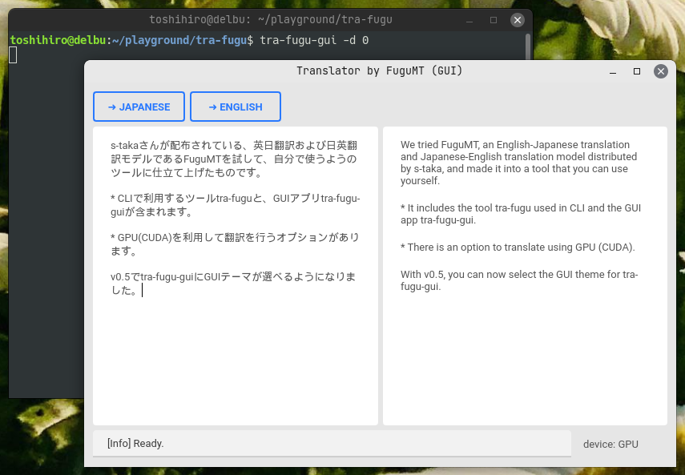

# tra-fugu

s-takaさんが配布されている、英日日英翻訳モデルであるFuguMT( https://github.com/s-taka/fugumt )を試し、その高性能さに驚いて、思わず自分で使うようにツールに仕立て上げたものです。

* CLIで利用するツール `tra-fugu` と、GUIアプリ `tra-fugu-gui` が含まれています
* GPU(CUDA)を利用して翻訳を行うオプションを持ちます

## インストール

```
git clone https://github.com/tos-kamiya/tra-fugu
cd tra-fugu
python -m pip install .
```

## 利用法

### コマンドラインツール tra-fugu

英→日翻訳

```
tra-fugu -j テキストファイル
```

日→英翻訳

```
tra-fugu -e テキストファイル
```

コマンドラインオプション`-d 0` (0はGPUのデバイスID)を指定すると、CUDAを利用して翻訳を行います。

### GUIアプリ tra-fugu-gui

`tra-fugu-gui`を実行すると開くウィンドウの左側のペインに文章を入力し、「➡ Japanese」や「➡ English」ボタンを押すと、日本語訳、英訳を行います。

`tra-fugu-gui`を実行するときにコマンドラインオプション`-d 0` (0はGPUのデバイスID)を指定すると、CUDAを利用して翻訳を行います。



## ライセンス

* tra-fugu 本体の（ https://github.com/tos-kamiya/tra-fugu にアップロードされている）ソースコードは Unlicense により配布します。
* FuguMT モデルは、CC BY-SA 4.0 ライセンスの元配布されています。また、利用目的は「研究用途での使用」、「動作や出力に関して一切の責任を負えない」と明記されている点にもご注意ください。 出典: https://staka.jp/wordpress/?p=413

## 謝辞

* 有用なモデルを公開していただいている s-taka さんに感謝いたします。